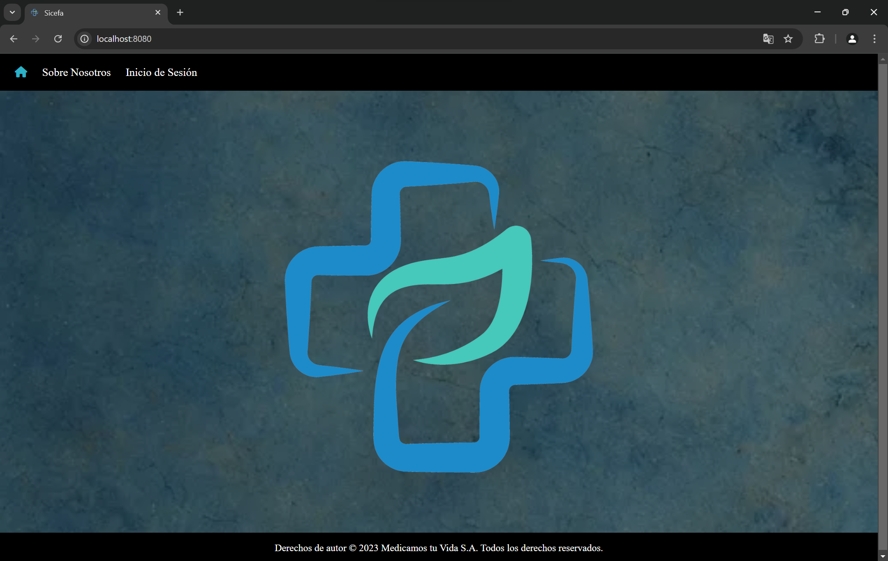
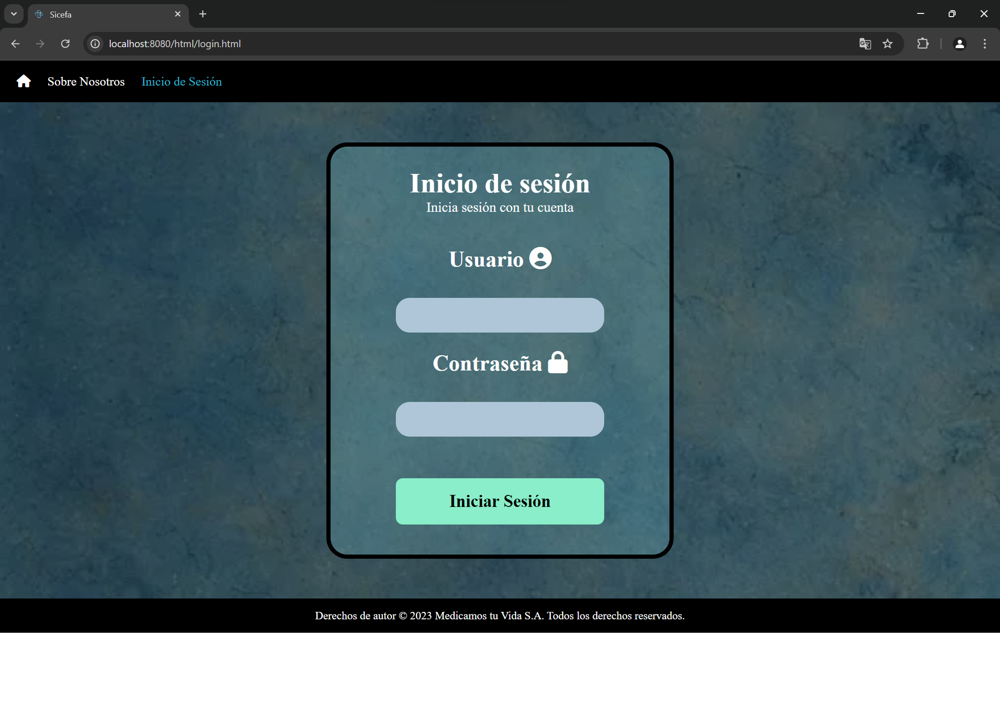
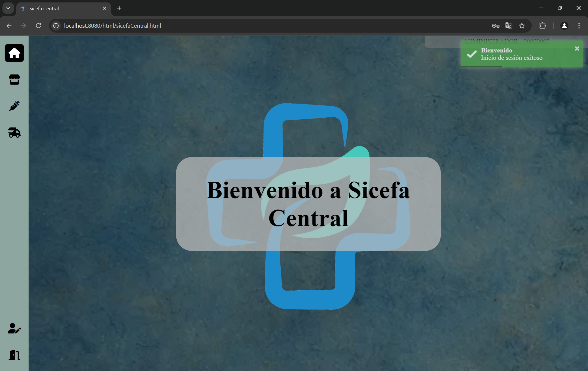

# Sicefa


Proyecto Sistema Central de Farmacias, elaborado en la Universidad Tecnologica de León durante mis estudios en TSU Desarrallo de Software Multiplataforma


## ✨ Demo

[https://sicefa.onrender.com/](https://sicefa.onrender.com/)

- Usuario: Administrador
- Contraseña: Administrador


## 🖥️ Ejecución en un entorno local

Clona el proyecto

```bash
  git clone https://github.com/MelchorRuiz/Sicefa
```

Ve al directorio del proyecto

```bash
  cd Sicefa
```

Crea el archivo .war

```bash
  ant war
```

Inicia el servidor

```bash
  docker-compose up --build
```


## 🖼️ Screenshots





